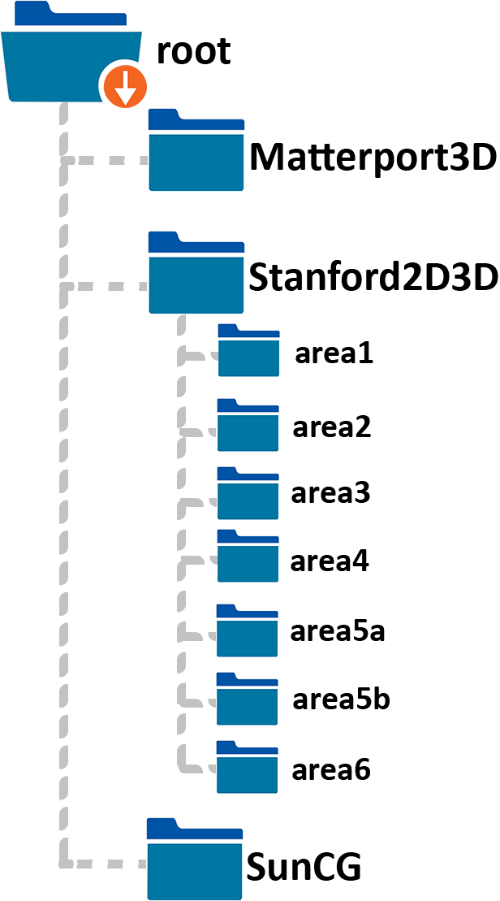

<p>
  
</p>

# Overview
__3D60__ is a collective dataset generated in the context of various 360<sup>o</sup> vision research works __\[[1](#OmniDepth)\]__, __\[[2](#SVS)\]__, __\[[3](#HyperSphere)\]__. 
It comprises multi-modal stereo renders of scenes from realistic and synthetic large-scale 3D datasets (Matterport3D __\[[4](#Matterport3D)\]__, Stanford2D3D __\[[5](#Stanford2D3D)\]__, SunCG __\[[6](#SunCG)\]__).

## Motivation
> Modern 3D vision advancements rely on data driven methods and thus, task specific annotated datasets.
> Especially for geometric inference tasks like depth and surface estimation, the collection of high quality data is very challenging, expensive and laborious.
> While considerable efforts have been made for traditional pinhole cameras, the same cannot be said for omnidirectional ones.
> Our __3D60__ dataset fills a very important gap in data-driven spherical 3D vision and, more specifically, for monocular and stereo dense depth and surface estimation.
> _We originate by exploiting the efforts made in providing synthetic and real scanned 3D datasets of interior spaces and re-using them via ray-tracing in order to generate high quality, densely annotated spherical panoramas._

## News & Updates

- [x] _11 Oct 2021_: **An updated spherical depth estimation dataset (see [here](https://vcl3d.github.io/Pano3D/)] has been released** that fixes the lighting bias issue introduced during rendering and additionally contains:  
  - A solid baseline
  - New metrics
  - Additional data (GibsonV2)
  - Higher resolution renders
  - Distribution shifted splits
- [x] _17 Oct 2019_: Released a real domain only version of the dataset that does not include SunCG and contains all viewpoints and modalities in a single Zenodo repository. Check the [download page](./download.md) for details
  

## Description

### Formats
We offer 3 different modalities as indicated below, with the corresponding data formats following and the invalid values (due to imperfect scanning, holes manifest during rendering) denoted in brackets.

| __Image Type__        | __Data Format__           | __Invalid Value__  |
| ------------- |:-------------:|:-----:|
| `Color` images | <code>.png</code> | gray, _i.e._ `(64, 64, 64)` |
| `Depth` maps | single channel, floating point <code>.exr</code> | `(inf)` |
| `Normal` maps | 3-channel (_x, y, z_), floating point <code>.exr</code> | `(0.0f, 0.0f, 0.0f)` & `(nan, nan, nan)` |

### Camera positions
<p style="text-align: justify;">
Our spherical panoramas are generated using the provided camera poses for Matterport3D and Stanford2D3D, while for SunCG we render from the center of the bounding box of each building, which resulted to rendering artifacts and thus, a number of invalid renders.
</p>

## Showcase
<p align="center">
  <div> 
    
  </div>
  <div> 
    
  </div>
  <div> 
    
  </div>
  <p style="clear:both;"/>
</p>

# Usage

## Download
<p style="text-align: justify;">
<p><b>Important:</b> Please download the new <a href="https://vcl3d.github.io/Pano3D/">Pano3D</a> dataset which supersedes 3D60. Note that only 3D60 currently offers stereo renders and not Pano3D. If you need the stereo renders follow the striked-through process below, otherwise see the <a href="https://vcl3d.github.io/Pano3D/download/">download data</a> section of Pano3D.</p>
<p style="text-align: justify;">
<p style="text-align: justify;">
<p><del>We follow a <b>two-step</b> procedure to download the <b>3D60</b> dataset.</del></p>
<p style="text-align: justify;">
<ol>
  <li>
    <del>Access to 3D60 dataset requires agreement with the terms and conditions of each of the 3D datasets that were used to create (i.e. render) the 3D60 dataset. Therefore, in order to grant you access to this dataset, we need you to first fill <a href="https://forms.gle/ikJW2QU88GDahEBr6">this request form.</del></a>
  </li>
  <li>
    <del>Then you need to perform a request for access to Zenodo, the data hosting portal for 3D60 (more information can be found in our <a href="download.html">download</a> page). Due to data-size limitations, the dataset is split into three volumes, which respectively contain the <a href="https://zenodo.org/record/3407840#.XX06KygzaUk">Central</a> (<i>i.e.</i> Left-Down), <a href="https://zenodo.org/record/3407875#.XX08HCgzaUk">Right</a> and <a href="https://zenodo.org/record/3408441#.XX1QWCgzaUk">Up</a> viewpoints respectively. Therefore, a separate request for access needs to be made for each viewpoint to the corresponding Zenodo repository. We also offer a <a href="https://zenodo.org/record/3492155#.XagQA-gzaUk">Real Only</a> domain version of the dataset (<it>i.e.</it> Matterport3D and Stanford2D3D), which also contains all viewpoints (<it>i.e.</it> center, right and up) and all modalities (<it>i.e.</it> color, depth and normal) bundled up in a single Zenodo repository.
  </del></li>
</ol>
</p>
<p style="text-align: justify;">
  <del><b>Note</b> that only completing one step of the two (<i>i.e.</i> only filling out the form, or only requesting access from the Zenodo repositories) <b>will not</b> be enough to get access to the data. We will do our best to contact you in such cases and notify you to complete all steps as needed, but our mails may be lost (e.g. spam filters/folders). 
  The only exception to this, is if you have already filled in the form and need access to another Zenodo repository (for example you need extra viewpoint renders which are hosted on different Zenodo repositories), then you only need to fill in the Zenodo request but please, make sure to mention that the form has already been filled in so that we can verify it.
</del></p>

<p style="text-align: justify;">
<del>Each volume is broken down in several <code>.zip</code> files (2GB each) for more convenient downloading on low bandwidth connections. You need all the <code>.zip</code> archives of each volume in order to extract the containing files.
</del></p>
</p>

## Data-splits:

<p style="text-align: justify;">
  We provide the train, validation and test-splits that we used for each related research task that used parts of the 3D60 dataset:
</p>

* Omnidepth: Dense Depth Estimation for Indoors Spherical Panoramas __\[[1](#OmniDepth)\]__
* Spherical View Synthesis for Self-Supervised 360<sup>o</sup> Depth Estimation __\[[2](#SVS)\]__
* 360<sup>o</sup> Surface Regression with a Hyper-Sphere Loss __\[[3](#HyperSphere)\]__

However, we recommend using the [common splits]() used in the latter two works (__\[[2](#SVS), [3](#HyperSphere)\]__) as it is based on the official splits of the 3D datasets used to render the panoramas.

## Organization
<p>
  
</p>

## Tools

The 3D60 dataset is accompanied by [code @ GitHub](https://github.com/VCL3D/3D60) to:

- [x] Load Data:
  - [x] Flexible PyTorch data loaders, configurable to load only specific parts, modalities or placements
  - [x] Longitudinal rotation (_i.e._ circular shift) data augmentation
  - [x] Script to visualize the 3D60 dataset using visdom, as an example of using the PyTorch data loaders
- [x] Preparation Splits:
  - [x] Script to calculate the depth map statistics for each of its parts (_i.e._ distinct 3D datasets)
  - [x] Script to estimate 'outlier' renders whose depth distributions lie away or exceed certain thresholds
  - [x] Script to generate train/test/val splits for each part of the dataset (using each 3D dataset's official splits), also ignoring 'outliers'

## Citations
The 3D60 data have been generated during distinct works and thus, depending on which subset (_i.e._ modalities and/or placements) are used, please cite the corresponding papers as follows:

* __Depth maps__:
```
@inproceedings{zioulis2018omnidepth,
  title={Omnidepth: Dense depth estimation for indoors spherical panoramas},
  author={Zioulis, Nikolaos and Karakottas, Antonis and Zarpalas, Dimitrios and Daras, Petros},
  booktitle={Proceedings of the European Conference on Computer Vision (ECCV)},
  pages={448--465},
  year={2018}
}
```

* __Normals maps__:
```
 @inproceedings{karakottas2019360surface,
        author      = "Karakottas, Antonis and Zioulis, Nikolaos and Samaras, Stamatis and Ataloglou, Dimitrios and Gkitsas, Vasileios and Zarpalas, Dimitrios and Daras, Petros",
        title       = "360 Surface Regression with a Hyper-Sphere Loss",
        booktitle   = "International Conference on 3D Vision",
        month       = "September",
        year        = "2019"
      }
```

* __Stereo pairs__:
```
@inproceedings{zioulis2019spherical,
  author       = "Zioulis, Nikolaos and Karakottas, Antonis and Zarpalas, Dimitris and Alvarez, Federic and Daras, Petros",
  title        = "Spherical View Synthesis for Self-Supervised $360^o$ Depth Estimation",
  booktitle    = "International Conference on 3D Vision (3DV)",
  month        = "September",
  year         = "2019"
}
```

## Contact
Please direct any questions related to the dataset and tools to [nzioulis@iti.gr](mailto:nzioulis@iti.gr) or post a [GitHub issue](https://github.com/VCL3D/3D60/issues).

# Acknowledgements

This dataset has been generated within the context of the European Union’s Horizon 2020 research and innovation programme [__Hyper360__](http://hyper360.eu/) under grant agreement No 761934.

We would like to thank NVIDIA for supporting us with the donation of a NVIDIA Titan Xp GPU through the NVIDIA GPU Grant Program.


# References
<a name="OmniDepth"/>__\[[1](https://vcl.iti.gr//360-dataset)\]__ Zioulis, N.__\*__, Karakottas, A.__\*__, Zarpalas, D., and Daras, P. (2018). [Omnidepth: Dense depth estimation for indoors spherical panoramas](https://arxiv.org/pdf/1807.09620.pdf). In Proceedings of the European Conference on Computer Vision (ECCV).

<a name="SVS"/>__[[2](https://vcl3d.github.io/SphericalViewSynthesis/)]__ Zioulis, N., Karakottas, A., Zarpalas, D., Alvarez, F., and Daras, P. (2019). [Spherical View Synthesis for Self-Supervised 360<sup>o</sup> Depth Estimation](https://arxiv.org/pdf/1909.08112.pdf). In Proceedings of the International Conference on 3D Vision (3DV).

<a name="HyperSphere"/>__[[3](https://vcl3d.github.io/HyperSphereSurfaceRegression/)]__ Karakottas, A., Zioulis, N., Samaras, S., Ataloglou, D., Gkitsas, V., Zarpalas, D., and Daras, P. (2019). [360<sup>o</sup> Surface Regression with a Hyper-sphere Loss](https://arxiv.org/pdf/1909.07043.pdf). In Proceedings of the International Conference on 3D Vision (3DV).

<a name="Matterport3D"/> __\[[4](https://niessner.github.io/Matterport/)\]__ Chang, A., Dai, A., Funkhouser, T., Halber, M., Niessner, M., Savva, M., Song, S., Zeng, A. and Zhang, Y. (2017). [Matterport3d: Learning from rgb-d data in indoor environments](https://arxiv.org/pdf/1709.06158.pdf). In Proceedings of the International Conference on 3D Vision (3DV).

<a name="Stanford2D3D"/> __\[[5](http://buildingparser.stanford.edu/dataset.html)\]__ Armeni, I., Sax, S., Zamir, A.R. and Savarese, S., 2017. [Joint 2d-3d-semantic data for indoor scene understanding](https://arxiv.org/pdf/1702.01105.pdf). arXiv preprint arXiv:1702.01105.

<a name="SunCG"/> __\[[6](https://sscnet.cs.princeton.edu/)\]__ Song, S., Yu, F., Zeng, A., Chang, A.X., Savva, M. and Funkhouser, T., 2017. [Semantic scene completion from a single depth image](http://openaccess.thecvf.com/content_cvpr_2017/papers/Song_Semantic_Scene_Completion_CVPR_2017_paper.pdf). In Proceedings of the IEEE Conference on Computer Vision and Pattern Recognition (CVPR).
